<h1 align="center">uap_2026</h1>

  <strong>2026-labeled UAP video artifact and frame-analysis handoff</strong>

  <a href="media/source/DOW-UAP-PR49__Unresolved_UAP_Report__Department_of_the_Army__2026.mp4">Source MP4</a>
  |
  <a href="analysis/DOW-UAP-PR49__best_feed">Full image analysis set</a>
  |
  <a href="AI_REVIEW_BRIEF.md">AI review brief</a>
  |
  <a href="ARTIFACT_MANIFEST.md">Manifest</a>

  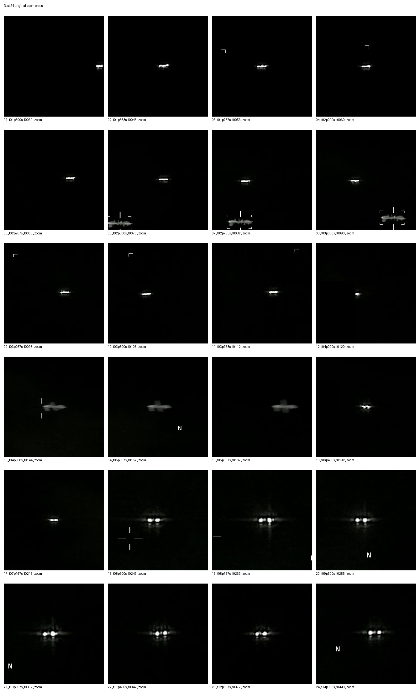

This repository organizes the only present file in the local UFO files set with `2026` in the filename:

`DOW-UAP-PR49__Unresolved_UAP_Report__Department_of_the_Army__2026.mp4`

The release being referenced here is the UFO files release from May 8, 2026. This project intentionally includes only that 2026 video and the derived frame/crop/contact-sheet work created from it.

This artifact is the result of a private inquiry assisted by Claude Opus and GPT Codex. GPT Codex produced the current structured frame handoff: native frames, scoped keyframes, zoom crops, annotated references, visibility-enhanced helper views, and contact sheets.

## Visual Index

| Opening event, zoomed | Opening event, full frame |
|---|---|
|  | 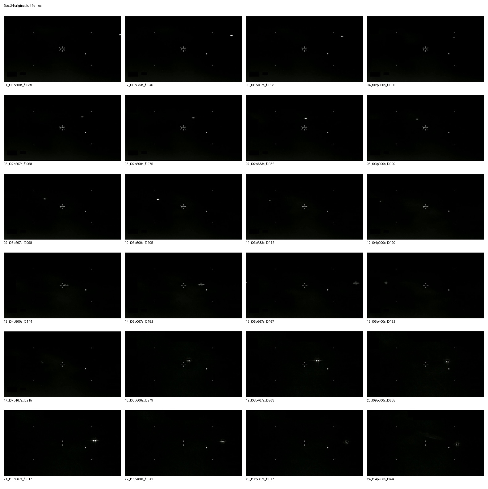 |

| First 12 seconds, dense sweep | Whole video, 1 fps sweep |
|---|---|
| 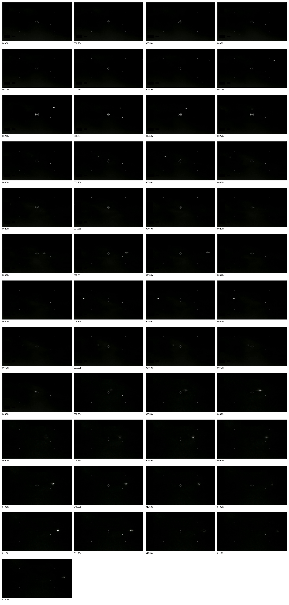 | 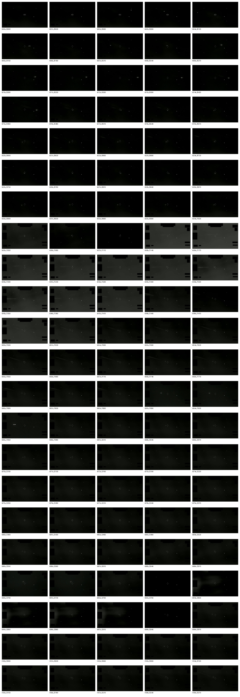 |

| Detector guide | Motion path guide |
|---|---|
| 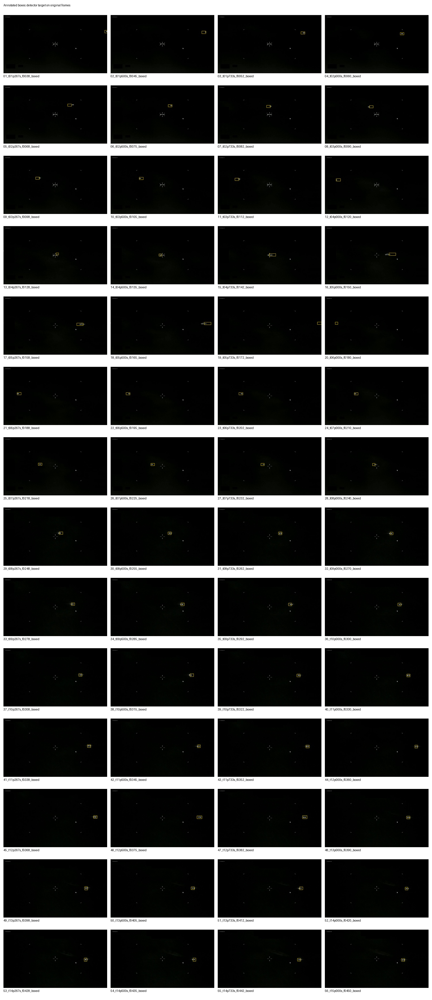 | 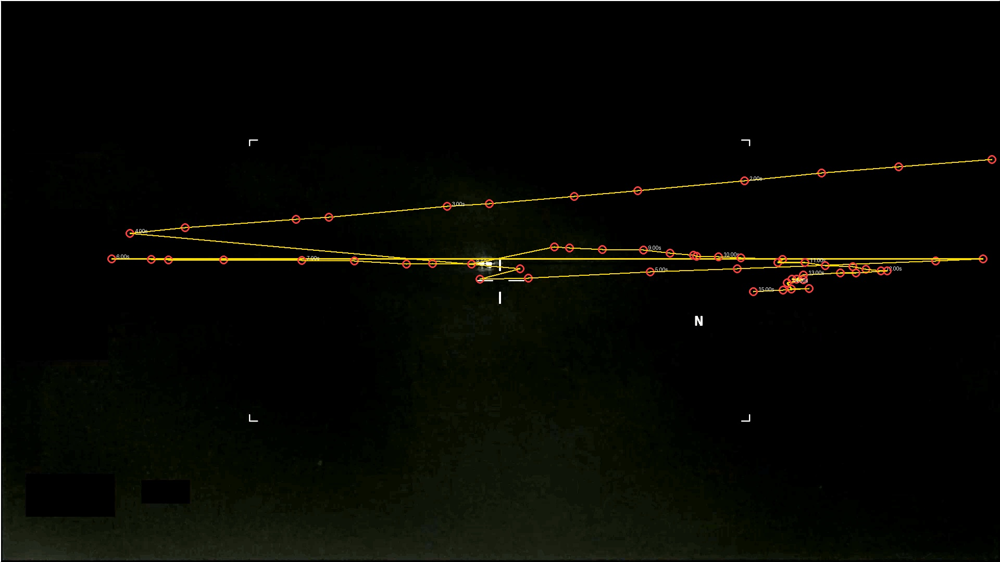 |

## Selected Frames

These are review anchors from the first visible event and later high-signal passes. Use the linked originals for inspection; the previews below are already tracked in the repository.

| 1.53s, right-side entry | 4.80s, central pass | 5.07s, profile view |
|---|---|---|
| <a href="analysis/DOW-UAP-PR49__best_feed/best_24_zoom_original/02_t01p533s_f0046_zoom.jpg">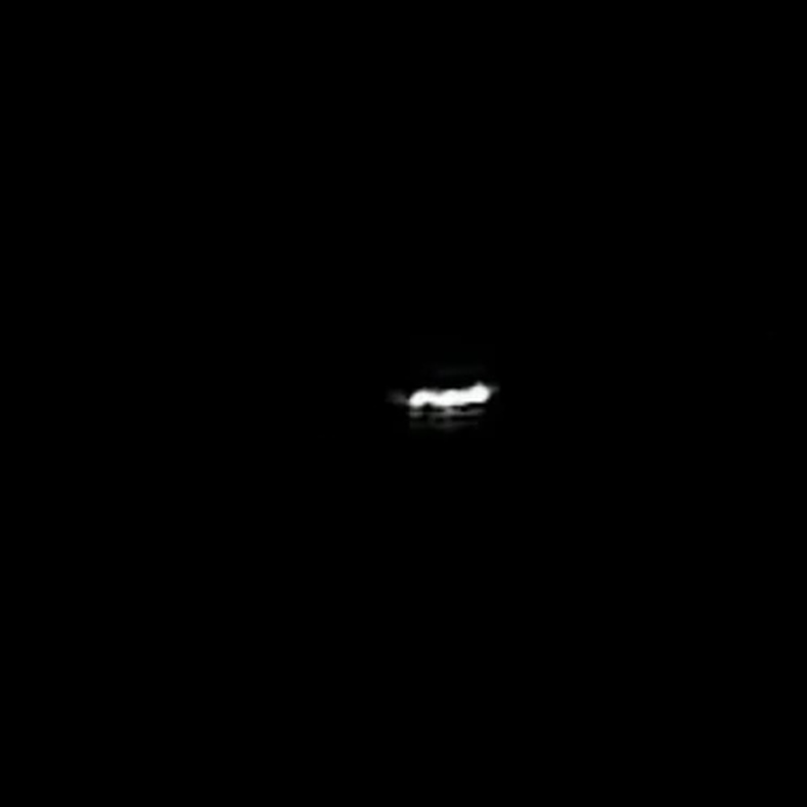</a> | <a href="analysis/DOW-UAP-PR49__best_feed/best_24_zoom_original/13_t04p800s_f0144_zoom.jpg">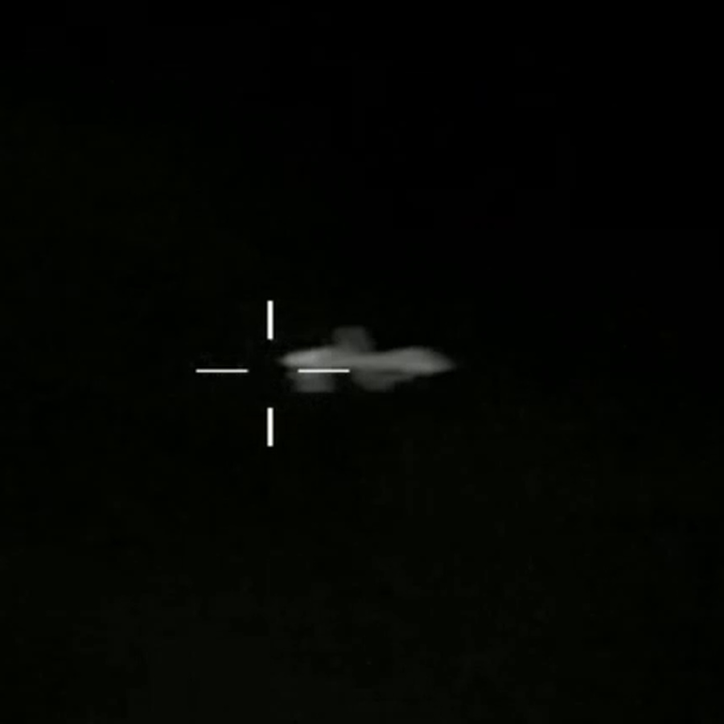</a> | <a href="analysis/DOW-UAP-PR49__best_feed/best_24_zoom_original/14_t05p067s_f0152_zoom.jpg">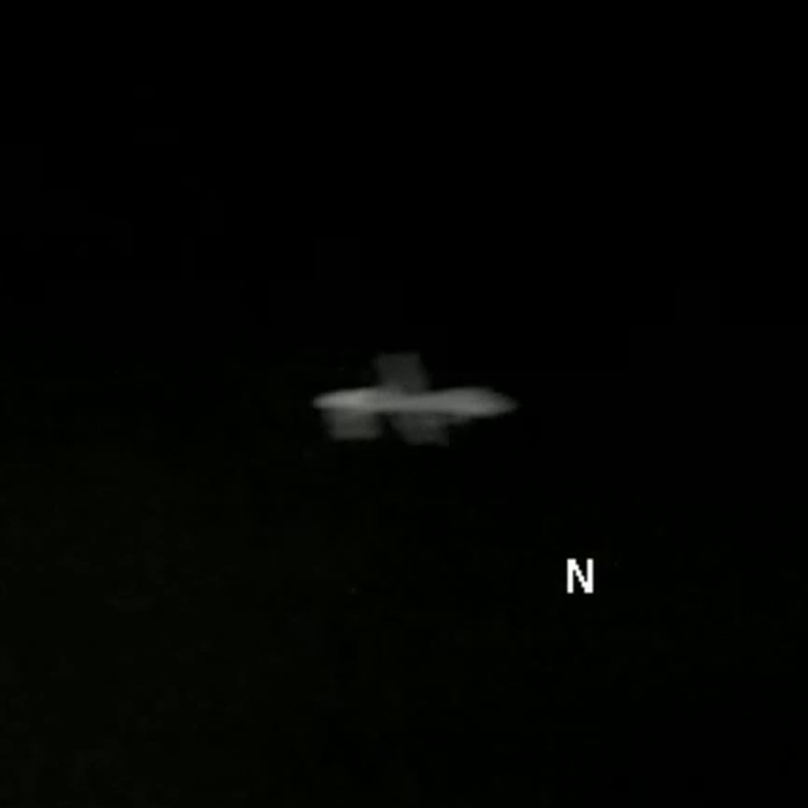</a> |

| 8.30s, clustered light | 8.77s, bright cluster | 12.57s, later pass |
|---|---|---|
| <a href="analysis/DOW-UAP-PR49__best_feed/best_24_zoom_original/18_t08p300s_f0249_zoom.jpg">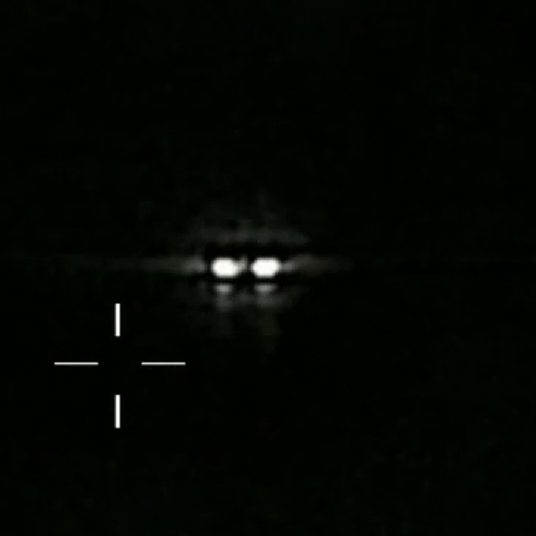</a> | <a href="analysis/DOW-UAP-PR49__best_feed/best_24_zoom_original/19_t08p767s_f0263_zoom.jpg">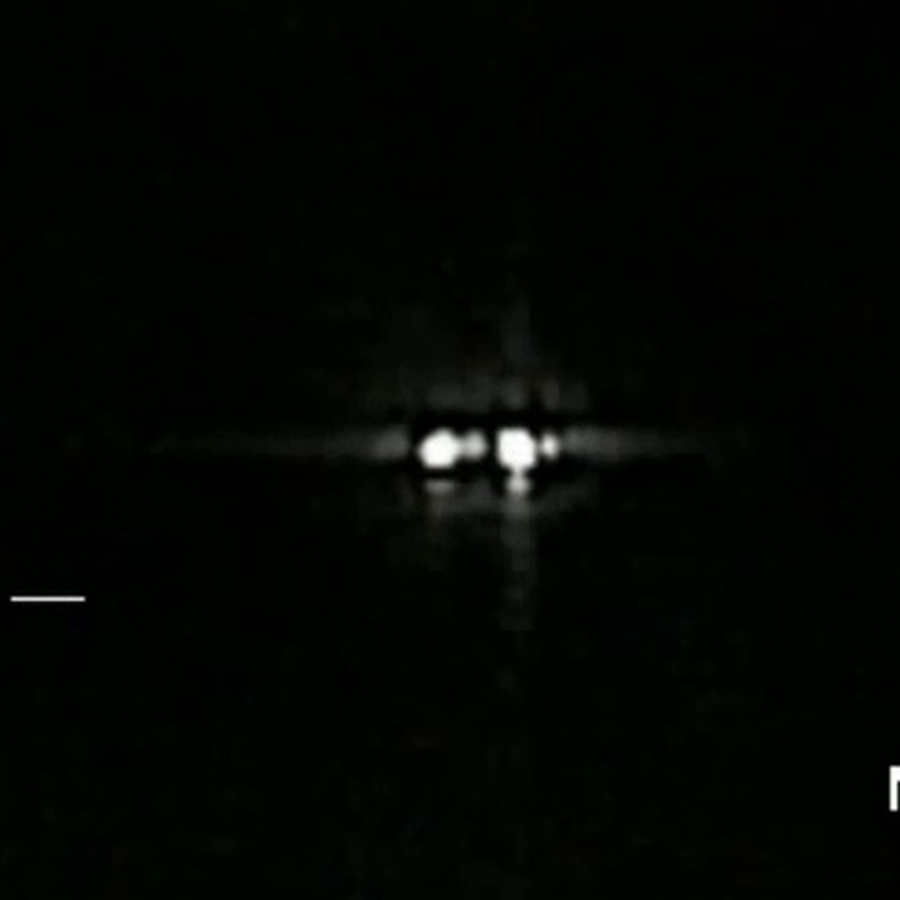</a> | <a href="analysis/DOW-UAP-PR49__best_feed/best_24_zoom_original/23_t12p567s_f0377_zoom.jpg">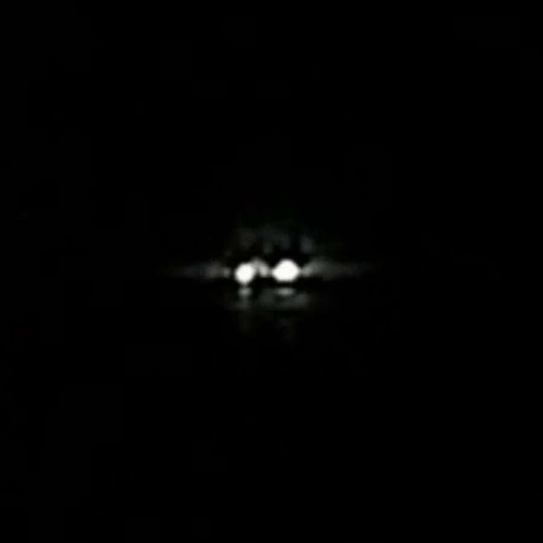</a> |

## Review Windows

- Right-side entry begins around `1.30s-1.53s`.
- First high-speed pass is covered at native frame rate from `1.20s-5.80s`.
- Broader opening event is covered from `1.20s-15.00s`.
- Whole-video coverage is included at `1 fps` for later activity checks.

## Repository Map

- `media/source/` contains the original 2026 MP4.
- `analysis/DOW-UAP-PR49__best_feed/best_24_full_original/` contains selected original full frames.
- `analysis/DOW-UAP-PR49__best_feed/best_24_zoom_original/` contains selected original zoom crops.
- `analysis/DOW-UAP-PR49__best_feed/entry_pass_1p20s_to_5p80s_native_30fps_full/` contains the native-rate first pass.
- `analysis/DOW-UAP-PR49__best_feed/opening_event_1p20s_to_15p00s_10fps_full/` contains the broader opening event at 10 fps.
- `analysis/DOW-UAP-PR49__best_feed/scoped_keyframes_*` contains original, annotated, enhanced, and zoomed scoped keyframes.
- `analysis/DOW-UAP-PR49__best_feed/whole_video_every_1s_full_original/` contains whole-video coverage at 1 fps.

## Interpretation Boundary

The source video and original extracted frames are the evidence inputs. Annotated, cropped, and visibility-enhanced files are helper views only. This repository does not claim origin, identity, authenticity, or sensor context beyond what is visible in the provided media.
